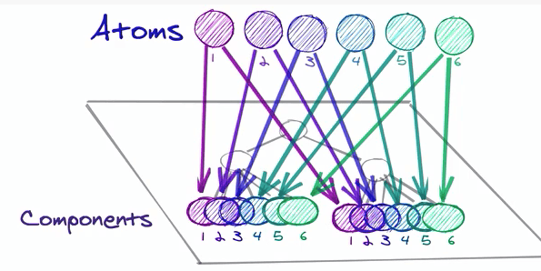

# Atomic 패턴

상태를 원자처럼 작은 단위로 나누는 패턴이다.

- 각 데이터를 **Key**로 구분하여 이전 상태의 불변성을 유지하기 때문에 **재사용성**, **유지보수성** 용이
- 체계적인 **상태 관리**에 용이하다.
- 많은 **atom**으로 데이터를 나눌 경우 관리가 어려워질 수 있다.
- 데이터가 다수의 **atom**으로 분산되어 데이터 추적에 어려움이 있다.
- **React 트리** 안에 상태를 저장하고 관리한다는 특징이 있어 **Context**, **useState** 등과 사용 방법이 비슷하다. ⇒ **러닝커브**가 낮다.
