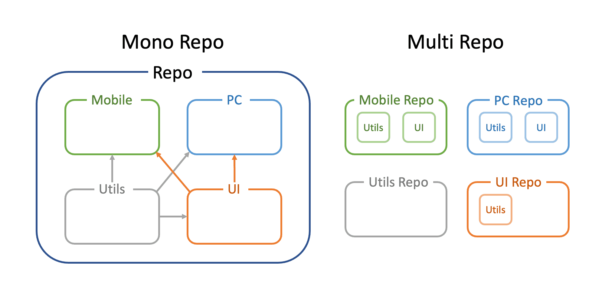

# 모노레포(Monorepo)

- 여러 앱/라이브러리를 **하나의 레포지토리**에서 관리하는 방식

### 모노레포 사용 목적

- **코드 공유**
- 일관된 **버전/도구**
- 빠른 **빌드/테스트**
- 일관된 **리뷰/배포 파이프라인**

### 모노레포 장단점

**장점**

- **공유 쉬움**: 내부 패키지로 재사용 극대화
- **일관성**: **TS/ESLint/Prettier/Commit** 규칙을 중앙에서 관리.
- **속도**: **캐시/증분 빌드(only-affected)**로 **CI** 빠름
- **관계 가시화**: 의존성 그래프 기반으로 명확한 관계 확인

**단점**

- **툴링 러닝커브**: **Turborepo**/**Nx 개념** 이해 필요.
- **경계 관리**: **모듈 경계 규칙** 필수

## 실행도구

**패키지 매니저**

- `pnpm workspaces` ⇒ 빠르고 충돌 적음

**실행 러너**

- `Turborepo`: 간단·Vercel 연동
- `Nx`: 강력한 경계 규칙

**버전/릴리스**

- `Changesets` ⇒ **내부 패키지 버저닝**·**릴리스 자동화**
